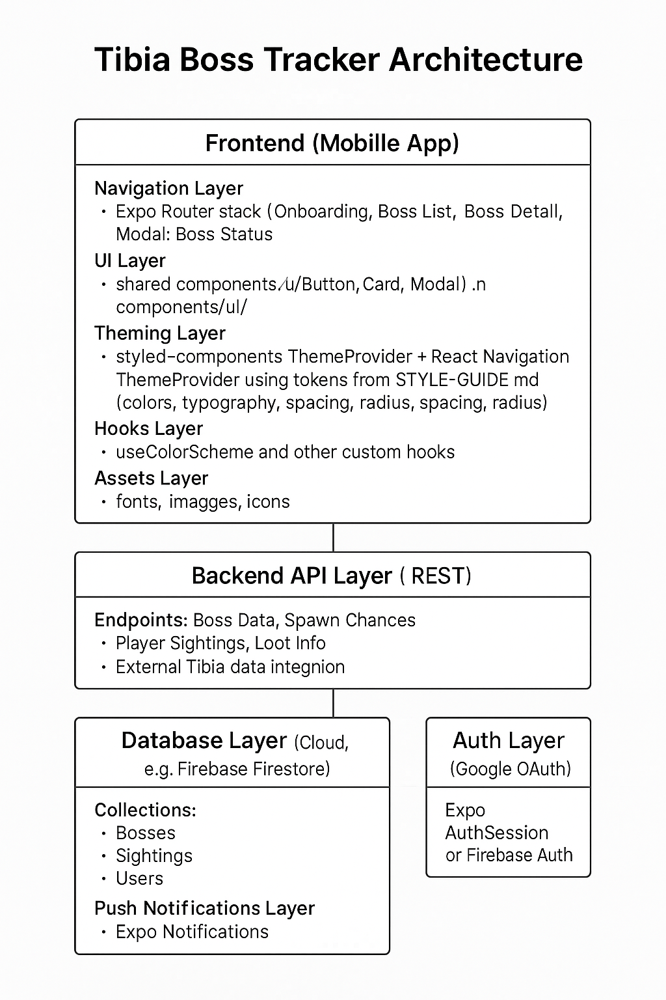

# 🏗 Architecture Overview — Tibia Boss Tracker

## 1) Goals & Constraints
- **Offline‑first:** Users can mark/watch bosses without network and sync later.
- **Fast MVP:** Expo SDK 53 + AI‑assisted docs/design to ship quickly.
- **Modular:** Add or remove features (auth, push, analytics) without rewrites.
- **Scalable data:** Local cache now, thin backend later (existing API or Supabase).

## 2) High‑Level Architecture
**Layers**
1. **UI Layer** — Expo Router screens + themed components (styled‑components).
2. **State Layer** — Server state: **TanStack Query**; UI state: **Zustand**.
3. **Data Layer** — Fetch client + **Zod** validation + **SQLite** offline cache.
4. **Service Layer** — Auth (Google), Push, **Sync Worker**, Analytics/Crash (Sentry).
5. **Backend (future or existing)** — REST returning typed JSON.

> Style & tokens come from **[`docs/design/STYLE-GUIDE.md`](../design/STYLE-GUIDE.md)** and are exposed to code via `src/theme/`.


## 3) Technology Choices

| Area              | Tech                                      | Why |
|-------------------|-------------------------------------------|-----|
| Navigation        | **Expo Router**                           | File‑based routing, Expo‑native DX |
| Theming           | **styled‑components** + React Navigation theme | Single source of truth (tokens) across UI & headers |
| Server State      | **@tanstack/react-query**                 | Caching, background refresh, optimistic mutations |
| UI/Local State    | **zustand**                               | Minimal boilerplate for filters, toggles, UI flags |
| Offline Storage   | **expo-sqlite**                           | Reliable local DB for list/detail + mutation queue |
| Validation        | **zod**                                   | Runtime schema validation for API safety |
| Auth              | **expo-auth-session** (Google)            | Simple secure sign‑in |
| Push              | **expo-notifications**                    | Alerts for sightings/events |
| Analytics/Crash   | **Sentry**, Expo Analytics                | Observability from day one |

## 4) Data Model (initial)

```text
User     { id, google_id, nickname, world, created_at }
Boss     { id, name, location, image_url? }
Sighting { id, boss_id, world, seen_at, seen_by_user_id }
Status   { id, boss_id, world, last_watched_at, last_killed_at? }
```
- Status provides quick read for “chance %” (computed client or server).
- If both watched/killed exist for the same period, killed wins.

## 5) Data Flow (happy path)
1.	Boss List opens → React Query loads from cache/SQLite, then network.
2.	User taps Mark as Watched / Mark as Dead → optimistic update (instant UI).
3.	Mutation stored in pending_mutations (SQLite) if offline.
4.	Sync Worker flushes queued mutations when online/app focused.
5.	Server responds → cache & SQLite updated → UI stays consistent.

**Conflict policy**
- Server authoritative for last_killed_at.
- For watched timestamps, max timestamp wins per (boss_id, world).


## 6) Folder Structure

```text
app/
  _layout.tsx            # Providers (Nav + styled-components) + fonts
  index.tsx              # Redirect logic (onboarding vs bosses)
  onboarding.tsx         # World + Google sign-in
  bosses/
    index.tsx            # Boss List (search, filter, killed yesterday, list by chance)
    [id].tsx             # Boss Detail (location, sightings, loot)
  (modals)/
    _layout.tsx          # Modal stack group
    boss-status.tsx      # "Boss Killed?" dialog
  settings.tsx           # Notifications, world, language, about
assets/                  # Fonts, images, icons
components/
  ui/                    # Button, ButtonText, Card, etc.
constants/               # App-wide constants
docs/
  design/
    mid/ …
    high/ …
    STYLE-GUIDE.md
  ARCHITECTURE.md
hooks/                   # useColorScheme, custom state hooks
scripts/                 # Automation and utility scripts
theme/
  tokens.ts              # Colors/typography/spacing/radius (from STYLE-GUIDE.md)
  theme.ts               # Light/Dark themes shared by Nav + styled-components
types/                   # Global TypeScript types
  ```

## 7) API Shape (example, REST)

  ```text
GET  /bosses?world=Venebra
GET  /bosses/:id
GET  /bosses/:id/sightings?world=Venebra
POST /status/watch     { bossId, world, watchedAt }
POST /status/kill      { bossId, world, killedAt }
POST /auth/google      { idToken } → { accessToken }
```

- Responses validated with zod in data/schema.ts.
- Client attaches Authorization: Bearer <token> once signed in.

## 8) Sync Worker (outline)
- Triggers on:
  - app focus / foreground
  - network reconnect
  - interval (e.g., every 60s in foreground)
  - **Steps**:
	1.	Read pending_mutations (FIFO).
	2.	POST to API; on success, delete from queue and update cache/SQLite.
	3.	On conflict, apply policy (server win for killed; max timestamp for watched).
	4.	Retry with backoff; surface toast on repeated failure.

## 9) Quality, CI/CD, Security
- Type safety: zod parse all incoming data; narrow types at boundaries.
- Tests: unit (chance calc, reducers), component (lists, modals), basic E2E later.
- CI: lint + typecheck + tests on PRs.
- CD: EAS Build + EAS Update (OTA) with channels: dev, preview, production.
- Secrets: EAS Secrets / Secure Store on device, never in repo.
- Crash/analytics: Sentry init on app start; tag world/user (non‑PII).

## 10) Roadmap Fit
- Phase 1 (MVP): offline list/detail, optimistic mutations, local queue.
- Phase 2: real backend, full sync, push notifications.
- Phase 3: i18n, monetization (ads/pro), perf/UX polish.

## 11) Overview Diagram

As part of our goal to involve ChatGPT in **all steps of the development process**, we used it to produce a **UML-style high-level architecture diagram** for the **Tibia Boss Tracker** app.  
This ensures that both frontend and backend concepts are documented clearly before implementation begins, and keeps design, development, and planning fully aligned.

This diagram was generated through an iterative AI process:
1. Writing and refining a detailed **prompt** with ChatGPT.
2. Using the prompt to generate a clean, UML-style diagram.
3. Saving the diagram as a static asset for reference during development.

### 📜 Prompt Used

```text
Create a high-level UML-style architecture diagram for the app Tibia Boss Tracker (Expo SDK 53 + React Native).
The diagram must be grayscale/monochrome, minimalist, and export at 1440×2560 (portrait) or vector (SVG).
Use a legible sans-serif font (e.g., Inter/Roboto), min font size 14px, and auto text wrapping.
Ensure no text is truncated; apply adequate padding/margins to all boxes.
Each layer appears exactly once (no duplicates).

Content (exactly once each)
1.	Frontend (Mobile App)
•	Navigation Layer: Expo Router stack (Onboarding, Boss List, Boss Detail, Modal: Boss Status, Settings)
•	UI Layer: shared components (Button, Card, Modal) in components/ui/
•	Theming Layer: styled-components ThemeProvider + React Navigation ThemeProvider using tokens from STYLE-GUIDE.md (colors, typography, spacing, radius)
•	Hooks Layer: useColorScheme and other custom hooks
•	Assets Layer: fonts, images, icons
2.	Backend API Layer (REST)
•	Endpoints: Boss Data, Spawn Chances, Player Sightings, Loot Info, Authentication
•	External Tibia data integration
3.	Database Layer (Cloud, e.g., Firebase Firestore)
•	Collections: Bosses, Sightings, Users, Settings
4.	Auth Layer (Google OAuth)
•	Expo AuthSession or Firebase Auth
5.	Push Notifications Layer (Expo Notifications)

Visual rules
•	Use UML component/box notation with clear section titles.
•	Overall style: grayscale, thin borders, subtle drop shadows allowed, no bright colors.
•	Layout vertically from Frontend (top) → API → Database/Auth/Notifications (bottom/side).

Output: one clean image (PNG @1440×2560 or SVG). No decorative backgrounds or illustrations—focus on clarity.

```

### 📊 Generated Diagram



### 🗝️ Why this matters
- Keeps **architecture decisions documented** before writing code.
- Ensures **clear understanding** between contributors, even before backend implementation exists.
- Maintains **visual consistency** with the rest of the AI-generated documentation (wireframes, style guide, high-fidelity screens).
- Reinforces the **AI-assisted workflow**, where ChatGPT is involved not just in coding, but in **planning, design, and architecture**.

**References**
- Design tokens & usage: docs/design/STYLE-GUIDE.md
- Mid & High fidelity: docs/design/mid/ • docs/design/high/
