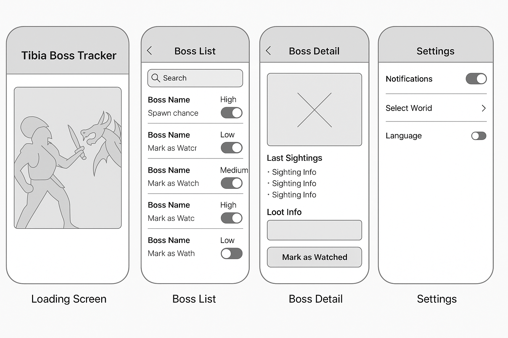

# 📱 Tibia Boss Tracker – Wireframe Design Notes

This document records the evolution of the **Tibia Boss Tracker (Mobile)** wireframes over three AI-assisted design iterations, along with the reasoning behind design decisions, what will be kept, and what will be discarded before development.

All wireframes were generated using **AI-powered image creation tools** based on detailed prompts describing desired features, layout, and interactions.  
Each iteration was produced by refining these prompts in collaboration with the AI, allowing for **fast turnaround** and **progressive improvements** without manually redrawing each screen.

## 🎯 Purpose of Using Mid-Fidelity Prototypes

For this project, I chose **mid-fidelity wireframes** instead of low-fidelity sketches or high-fidelity mockups because:

- **Clarity in layout** – Enough detail to show hierarchy and screen flow without being distracted by final colors, images, or branding.
- **Faster iteration** – AI-assisted generation made it quick to adjust layouts and features across iterations.
- **Developer-friendly** – Provides a clear structure for coding while leaving space for design adjustments during implementation.
- **Content focus** – Allows early testing of features and navigation without full visual polish.

Mid-fidelity wireframes strike a balance between **speed** and **usability for planning**, making them perfect for this early stage — especially when combined with AI to accelerate the process.

## 🖼 Iteration 1 – Initial Layout (AI-generated)

**Image Placeholder:**  

**Key Elements:**
- Mobile frame with clear navigation titles.
- **Boss List** using toggles to mark as watched.
- Boss Detail with sightings list and loot info.
- Minimalist Settings page.

**AI Usage:**
- Prompt described the app’s purpose, number of screens, UI elements, grayscale tone, and mid-fidelity style.
- AI generated the full layout, allowing immediate visual discussion.

**Good Stuff:**
- Clear navigation headers across screens.
- Simple structure that’s easy to implement.

**Discarded:**
- Toggles for “Mark as Watched” — replaced later with percentage spawn display.
- No onboarding or login flow in this version.

## 🖼 Iteration 2 – Percentage View + Social Login (AI-generated)

**Image Placeholder:**  

**Key Elements:**
- Replaced toggle with **spawn chance %** for each boss.
- Added **Google sign-in button** in Settings screen.
- Improved Boss List ordering and spacing.

**AI Usage:**
- Prompt updated to replace toggle controls with percentage indicators.
- Added request for social login and refined Boss List layout.

**Good Stuff:**
- Spawn percentages communicate more value to players.
- Social login setup started.

**Discarded:**
- Social login in Settings only — moved to onboarding in Iteration 3.
- Still no onboarding screens for world selection.

## 🖼 Iteration 3 – Onboarding + Location + Kill Confirmation (AI-generated)

**Image Placeholder:**  

**Key Elements:**
- **Onboarding flow**: Welcome + Select World + Social Login before showing data.
- Boss Detail now includes **Location** section.
- “Mark as Watched” triggers a modal asking if the boss was killed.
  - If "Yes" → record as killed.
  - If "No" → update last watched time only.

**AI Usage:**
- Prompt expanded to include onboarding sequence, location field, and modal dialog interaction.
- AI generated all five screens side-by-side for holistic view.

**Good Stuff:**
- Onboarding ensures data is personalized to player’s world.
- Location info helps with hunting preparation.
- Kill confirmation improves tracking accuracy.

**To Keep:**
- All onboarding steps, location field, kill confirmation modal.
- Percentage display in Boss List.

**To Discard:**
- None from this iteration — flows match MVP plan.

## 📌 Next Steps for Development

- Use Iteration 3 as the **main reference** for MVP implementation.
- Keep mid-fidelity wireframes as **living documentation** for any future design changes.
- Continue refining during development but avoid high-fidelity visuals until core features are functional.
