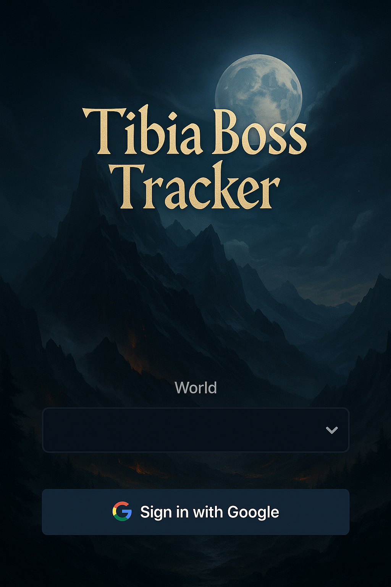
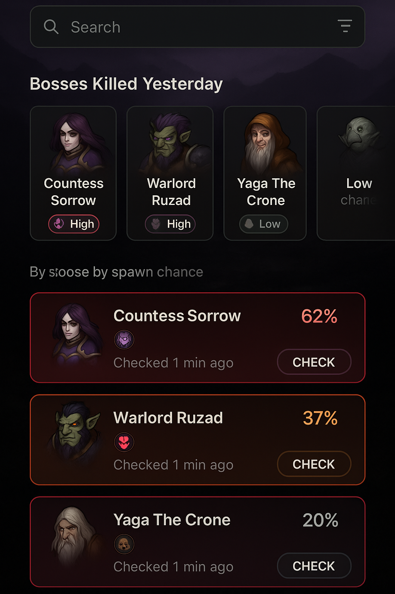
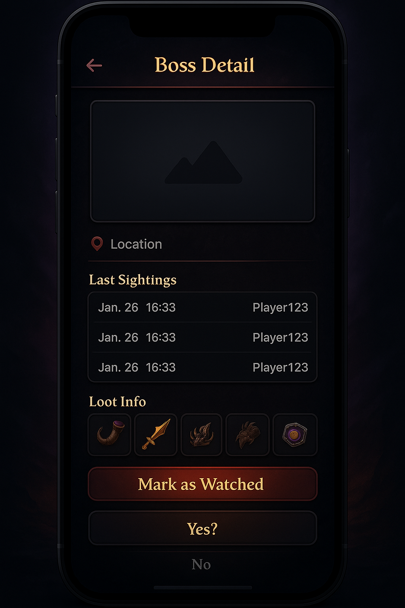
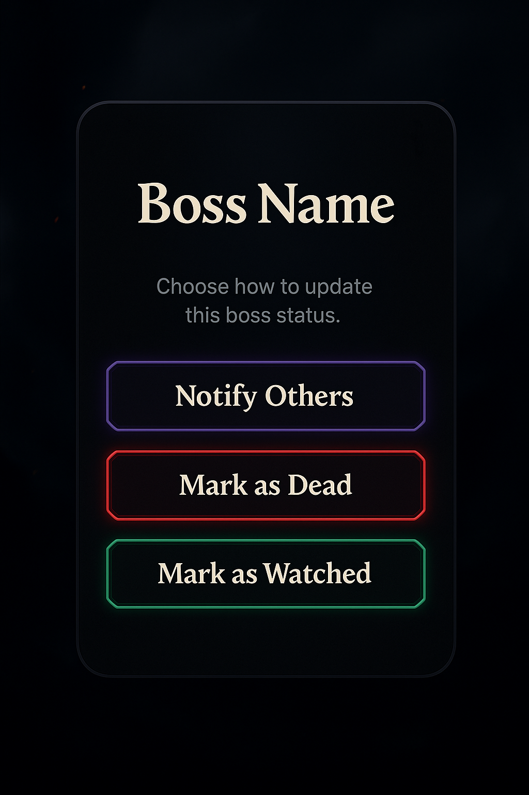
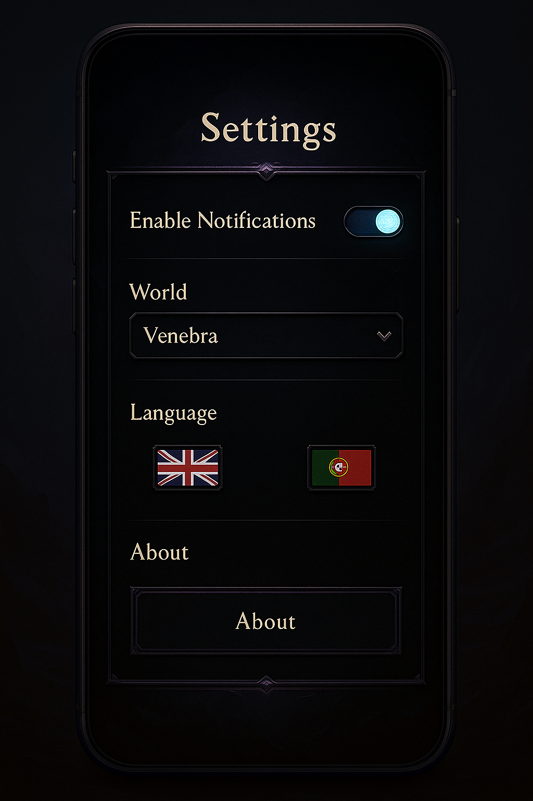

# High-Fidelity Prototype Generation – AI-Driven Exploration

## Overview

Our goal in this step was to explore **how much visual and design detail we could achieve directly through ChatGPT prompts** without relying on traditional design tools like Figma.  
We wanted to see if ChatGPT could help create **high-fidelity static prototypes** that are visually appealing, consistent, and useful as reference material for development.

It’s important to note that **these are static images**, not editable design files.  
While they can’t be updated in Figma, they serve as strong **visual references** to guide implementation in code.

The designs were created in **three steps**:  
1. **Prompt creation** – using ChatGPT to write detailed, structured prompts for each screen.  
2. **Prompt refinement** – adjusting and fine-tuning those prompts to ensure clarity and consistency.  
3. **Image generation** – asking ChatGPT to produce the high-fidelity image based on the refined prompt.

## Interaction Flow and Prompts Used

Below are the **exact prompts** we used and the resulting generated images for each key screen.

### **1. Login Page**

**Prompt:**

Design a high-fidelity mobile splash/onboarding screen for the fantasy-themed app Tibia Boss Tracker.
Requirements:
• Full-screen dark fantasy background (mountains, moonlight, mist, subtle warm highlights).
• App name “Tibia Boss Tracker” in large, readable fantasy-styled font with light shadow for contrast.
• World selection dropdown centered vertically on the screen.
• “Sign in with Google” button directly below the dropdown, styled as a primary button.
• Apply a slight dark overlay to the background to ensure UI elements are readable.
• Maintain a clean, modern layout while preserving the fantasy atmosphere.
• Format for mobile portrait orientation so it scales well across devices.

**Generated Image:**

### **2. Main Screen (Boss List)**

**Prompt:**

Design a high-fidelity mobile Boss List screen for the Tibia Boss Tracker app.
Layout:
• Top bar: Search field (left) + filter icon (right).
• Below: Horizontal carousel titled “Bosses Killed Yesterday” showing boss avatars, names, and small spawn chance badge.
• Main content: Vertical scrollable list of bosses sorted by spawn chance (High, Medium, Low) with percentage displayed.
• Boss list card: boss icon, name, chance %, last checked time, “Check” action button.
• Dark fantasy card style with glowing accent borders depending on chance color (red = high, orange = medium, gray = low).
• Background: very dark, subtle texture.

**Generated Image:**

### **3. Boss Detail Page**

**Prompt:**

Design a single high-fidelity mobile UI screen for the Boss Detail view of the fantasy-themed app Tibia Boss Tracker.
Requirements:
• Top bar: Boss name (centered) with a back arrow on the left.
• Main section:
• Large boss image placeholder at the top center.
• Location field below the image, with a location pin icon and readable text.
• “Last Sightings” section: scrollable list showing date/time and player name for each sighting.
• “Loot Info” section: grid or list of loot item icons with labels.
• Bottom section:
• Prominent “Mark as Watched” button.
• When tapped, it opens a modal asking “Boss Killed?” with Yes (confirm kill) and No (just watched) buttons.
• Theme: Dark fantasy style with clean, readable UI.
• Color cues: Subtle glowing accents, but keep focus on information clarity.
• Background: Very dark with a subtle fantasy texture.
• Format: Mobile portrait orientation only.
• Avoid showing any other app screens in the image — focus entirely on this single screen.

**Generated Image:**

### **4. Boss Status Modal**

**Prompt:**

Design a single high-fidelity mobile UI modal dialog for the fantasy-themed app Tibia Boss Tracker.
Requirements:
• Title: “Boss  Name” in bold, centered at the top.
• Description text: Short line saying “Choose how to update this boss status.”
• Three primary action buttons stacked vertically with equal width:
1. Notify Others – accent color (e.g., purple glow).
2. Mark as Dead – red glow effect.
3. Mark as Watched – green glow effect.
• Theme: Dark fantasy style consistent with the main app, with subtle glowing accents.
• Background: Very dark modal with semi-transparent backdrop behind it.
• Format: Mobile portrait orientation only.
• Focus entirely on this modal — do not show any other parts of the app UI.

**Generated Image:**

### **5. Settings Screen**

**Prompt:**

Create a high-fidelity mobile Settings screen for the fantasy-themed app Tibia Boss Tracker.
Requirements:
• Toggles for enabling/disabling notifications.
• World selection dropdown with the default value set to Venebra.
• Language switcher with flag icons.
• About section (generic, without mentioning TibiaWiki).
• Fantasy-themed but clean and modern dark UI with accent borders.
• Keep the design consistent with the other high-fidelity screens we created for the app.
• Format for mobile portrait orientation only.

**Generated Image:**

## Key Takeaways

- **ChatGPT + image generation** can produce surprisingly **detailed, high-fidelity prototypes** without relying on a dedicated design tool.
- These images are **static references** — all functional logic and responsive behavior must still be implemented in code.
- The **fantasy-themed consistency** across screens was preserved by reusing similar prompt structures and style descriptions.
- While this approach does **not replace a UI/UX designer**, it empowers standalone developers to be more creative and produce something beyond standard Material UI patterns.
